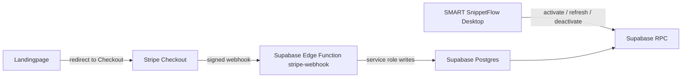

# SMART SnippetFlow License System

## Goal

SMART SnippetFlow starts with a single-seat desktop license:

- Stripe handles checkout, payment lifecycle, invoices, refunds, and customer billing portal.
- Supabase stores license ownership, current entitlement status, and device activations.
- The desktop app stores only a local activation cache and periodically refreshes it.
- The model stays expandable for cloud sync, teams, multiple seats, and multiple devices.

## Architecture



## Data Ownership

Stripe remains the payment source of truth. Supabase stores an operational projection that the app can query quickly:

- `license_customers`: customer identity and Stripe customer mapping.
- `licenses`: one purchasable entitlement, initially one seat and one active device.
- `license_activations`: active/deactivated device bindings.
- `stripe_events`: idempotency ledger for webhook processing.
- `license_audit_log`: support/debug history for important license changes.

## License States

The first production logic should treat these statuses as app-relevant:

- `active`: full access.
- `past_due`: optional grace behavior in the app.
- `canceled`: access remains until `current_period_end` for subscriptions.
- `expired`, `refunded`, `disabled`: no access.

For a one-time lifetime license, Stripe `checkout.session.completed` creates an `active` license with no expiry. For subscriptions, later Stripe invoice/subscription events update the same license.

## Security Model

- Stripe webhooks must verify the `stripe-signature` header against `STRIPE_WEBHOOK_SECRET` using the raw request body.
- The webhook function uses `SUPABASE_SERVICE_ROLE_KEY`; the desktop app never receives it.
- Tables have RLS enabled and expose no direct table policies to `anon`.
- The desktop app uses the public anon key only to call limited SECURITY DEFINER RPCs:
  - `activate_license`
  - `refresh_license_activation`
  - `deactivate_license_activation`
- Device fingerprints are sent as hashes only. Do not store raw machine serials or usernames.

## Checkout Metadata Contract

Configure Stripe Checkout or Payment Links to include enough metadata for the webhook:

- `product_key=smart_snippetflow_desktop`
- `license_type=single_seat`
- optional `seat_limit=1`
- optional `device_limit=1`

The webhook also records Stripe customer, checkout session, subscription, price, and payment intent IDs when present.

## Implementation Steps

1. Apply the Supabase migration in `supabase/migrations`.
2. Deploy the `stripe-webhook` and `create-checkout-session` Edge Functions with JWT verification disabled.
3. Set function secrets: `STRIPE_SECRET_KEY`, `STRIPE_WEBHOOK_SECRET`, `SUPABASE_URL`, `SUPABASE_SERVICE_ROLE_KEY`.
   Also set checkout secrets/config:
   - `STRIPE_PRICE_ID`
   - `STRIPE_CHECKOUT_MODE=subscription` for the annual license
   - `CHECKOUT_SUCCESS_URL`
   - `CHECKOUT_CANCEL_URL`
   - `CHECKOUT_ALLOWED_ORIGINS`
4. Start the desktop app with public Supabase config available to Electron:
   - `SMART_SNIPPETFLOW_SUPABASE_URL`
   - `SMART_SNIPPETFLOW_SUPABASE_ANON_KEY`
5. Configure the landingpage with:
   - `VITE_CHECKOUT_FUNCTION_URL=https://<project-ref>.supabase.co/functions/v1/create-checkout-session`
   - optional `VITE_STRIPE_PAYMENT_LINK` as fallback
6. Point Stripe webhook endpoint to `https://<project-ref>.supabase.co/functions/v1/stripe-webhook`.
7. Subscribe to at least:
   - `checkout.session.completed`
   - `customer.subscription.updated`
   - `customer.subscription.deleted`
   - `invoice.payment_succeeded`
   - `invoice.payment_failed`
   - `charge.refunded`
8. Add desktop activation UI:
   - User enters license key.
   - App generates/stores a stable local install ID.
   - App hashes that ID before calling Supabase.
   - App saves returned activation ID and status locally.
9. Add periodic refresh on launch and every few days while online.
10. Add billing portal link later for self-service invoice/card changes.

## Local / Deploy Commands

Once the Supabase CLI is available and the project is linked:

```bash
supabase db push
supabase secrets set --env-file supabase/.env
supabase functions deploy stripe-webhook
supabase functions deploy create-checkout-session
```

For a local function smoke test, use:

```bash
supabase functions serve create-checkout-session --env-file supabase/.env --no-verify-jwt
```

## Extension Path

- Multiple devices: raise `device_limit`; existing activation RPC already enforces it.
- Teams: add `organizations`, `organization_members`, and assign licenses to organizations.
- Cloud sync: associate local library data with `license_customer_id` or future Supabase Auth user.
- Trials: create `trialing` licenses with `current_period_end`.
- Offline grace: app can accept a recently refreshed `active` cache for a limited grace window.
